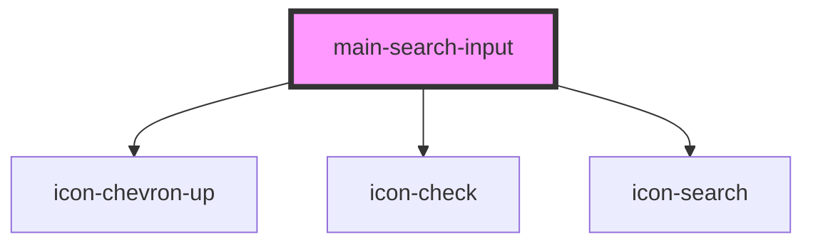

# my-alert

<!-- Auto Generated Below -->

## Properties

| Property         | Attribute         | Description | Type                                                | Default |
| ---------------- | ----------------- | ----------- | --------------------------------------------------- | ------- |
| `categories`     | --                |             | `{ text: string; value: string; icon?: string; }[]` | `[]`    |
| `suggestionsUrl` | `suggestions-url` |             | `string`                                            | `''`    |

## Dependencies

### Depends on

- icon-chevron-up
- icon-check
- icon-search

### Graph

----------------------------------------------

*Built with [StencilJS](https://stenciljs.com/)*
